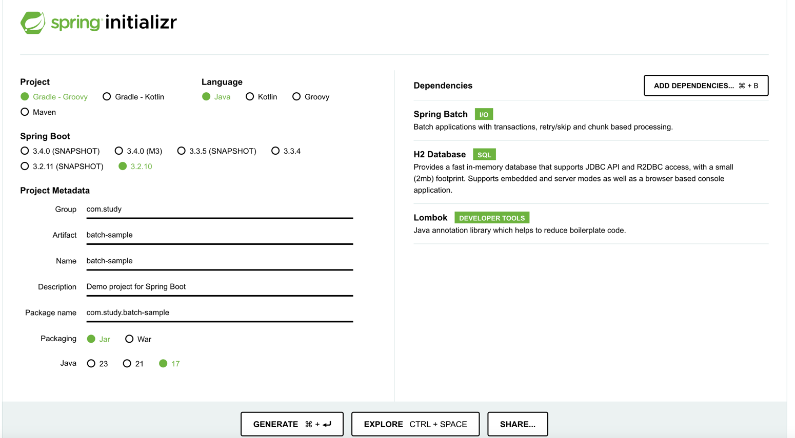

# 스프링 배치 시작하기

## 스프링 배치란?

> 배치(Batch)는 일괄처리 란 뜻을 갖고 있다.

스프링 배치

> 배치 작업을 보다 쉽게 구현하고 관리 할 수 있도록 돕는 프레임워크

언제 사용할까?

- 대규모 데이터를 일괄 처리해야 할 때 

왜 프레임워크를 사용할까 ?  굳이...

- 재시도 및 오류 처리
  - 대량 데이터 처리 중 오류가 발생 했을 때 특정 데이터에서 작업이 실패 해도 전체 작업이 중단되지 않고, 실패한 부분만 다시 재시도 하거나 롤백할 수 있다.
  - 수백만 건의 데이터를 수동으로 관리하려면 매우 어렵고 오류가 발생하기 쉬운 반면, Spring Batch 는 이러한 오류의 예외 상황을 자동으로 처리할 수 있다.
- 재시작 가능성 
  - 데이터가 너무 많아서 처리 중에 실패가 나면 어쩌지?? 
  - 스프링 배치는 작업이 중간에 실패 했을 경우, 작업을 처음부터 다시 실행할 필요 없이 마지막으로 성공한 지점부터 재시작 할 수 있는 기능을 제공한다.


## 프로젝트 생성




```java
@EnableBatchProcessing
@SpringBootApplication
public class BatchSampleApplication {

	public static void main(String[] args) {
		SpringApplication.run(BatchSampleApplication.class, args);
	}
}
```

@EnableBatchProcessing 은
Spring Batch의 기능을 활성화하고 배치 작업 설정을 쉽게 구성할 수 있도록 돕는 어노테이션이다.


## 메타 데이터 

Spring Batch 에서는 메타 데이터 테이블들이 필요하다.

메타 데이터 테이블 이란?
- 배치에서 중요한 작업에 대한 트래킹을 수행하는 테이블
- 스프링 배치에서도 메타데이터를 관리 해야 한다.


H2 DB 를 사용하면 Spring Boot 가 실행 될 때 해당 테이블을 자동으로 생성해 준다.

MySQL 이나 Oracle 과 같은 DB 는 개발자가 직접 생성해야 한다.


#### BATCH_JOB_INSTANCE 

- 스키마 중 가장 기본이 되는 배치 잡 인스턴스 테이블이다.
- 배치가 수행되면 Job 이 생성이 되고, 해당 잡 인스턴스에 대해서 관련된 모든 정보를 가진 최상위 테이블이다.

```sql
CREATE TABLE BATCH_JOB_INSTANCE  (
  JOB_INSTANCE_ID BIGINT  PRIMARY KEY ,
  VERSION BIGINT,
  JOB_NAME VARCHAR(100) NOT NULL ,
  JOB_KEY VARCHAR(32) NOT NULL
);
```
- JOB_INSTANCE_ID : 인스턴스에 대한 유니크 아이디이다. JobInstance 객체의 getId 로 획득이 가능하다.
- VERSION : 버전 정보 
- JOB_NAME : 배치잡 객체로 획득한 잡 이름이다. 인스턴스를 식별하기 위해 필요하다.
- JOB_KEY : JobParameter 를 직렬화 한 데이터 값이며, 동일한 잡을 다른 잡과 구분하는 값이다. 이 JobParameter 가 동일할 수 없으며 , JOB_KEY 는 구별 될 수 있도록 달라야 한다.

#### BATCH_JOB_EXECUTION_PARAMS

- JobParameter 에 대한 정보를 저장하는 테이블이다. 
- 여기에는 하나 이상의 key/value 쌍으로 Job에 전달되며, job 이 실행될 때 전달된 파라미터 정보를 저장하게 된다.
- 각 파라미터는 IDENTIFYING 이 true 로 설정되면 , JobParameter 생성시 유니크한 값으로 사용된 경우라는 의미가 된다.
- 테이블은 비정규화 되어 있고, 구조는 다음과 같다.

```sql
CREATE TABLE BATCH_JOB_EXECUTION_PARAMS  (
	JOB_EXECUTION_ID BIGINT NOT NULL ,
	PARAMETER_NAME VARCHAR(100) NOT NULL ,
	PARAMETER_TYPE VARCHAR(100) NOT NULL ,
	PARAMETER_VALUE VARCHAR(2500) ,
	IDENTIFYING CHAR(1) NOT NULL ,
	constraint JOB_EXEC_PARAMS_FK foreign key (JOB_EXECUTION_ID)
	references BATCH_JOB_EXECUTION(JOB_EXECUTION_ID)
);
```

- JOB_EXECUTION_ID : 잡 실행 아이디어이며 이것은 BATCH_JOB_EXECUTION 으로 부터 온 외래키이다. 각 실행마다 여러 행이 저장된다.
- PARAMETER_NAME : 파라미터 이름
- PARAMETER_TYPE : 파라미터의 타입
- PARAMETER_VALUE : 파라미터 값
- IDENTIFYING : 파라미터가 JobInstance 의 유니크 성을 위해 사용된 파라미터라면 true 로 세팅된다.
- 이 테이블에는 기본키가 없다.

#### BATCH_JOB_EXECUTION 

- JobExecution 과 관련된 모든 정보를 저장한다.
- Job이 매번 실행될 때, JobExecution 이라는 새로운 객체가 있으며, 이 테이블에 새로운 row로 생성이 된다.

```sql
CREATE TABLE BATCH_JOB_EXECUTION  (
  JOB_EXECUTION_ID BIGINT  PRIMARY KEY ,
  VERSION BIGINT,
  JOB_INSTANCE_ID BIGINT NOT NULL,
  CREATE_TIME TIMESTAMP NOT NULL,
  START_TIME TIMESTAMP DEFAULT NULL,
  END_TIME TIMESTAMP DEFAULT NULL,
  STATUS VARCHAR(10),
  EXIT_CODE VARCHAR(20),
  EXIT_MESSAGE VARCHAR(2500),
  LAST_UPDATED TIMESTAMP,
  constraint JOB_INSTANCE_EXECUTION_FK foreign key (JOB_INSTANCE_ID)
  references BATCH_JOB_INSTANCE(JOB_INSTANCE_ID)
) ;
```

- JOB_EXECUTION_ID : 배치자 실행 아이디, 실행을 유니크하게 구분할 수 있다. 칼럼의 값은 JobExecution 의 getId 메소드로 획득이 가능하다.
- VERSION : 버전 정보
- JOB_INSTANCE_ID : BATCH_JOB_INSTANCE 테이블의 기본키로 외래키다. 이는 execution 이 소속된 인스턴스가 된다. 하나의 인스턴스에는 여러 execution 이 있을 수 있다.
- CREATE_TIME : execution 이 생성된 시간이다.
- START_TIME : execution 이 시작된 시간이다.
- END_TIME : execution 이 종료된 시간이다. 성공이든 실패든 남게된다. 잡이 현재 실행중이 아닐 때 열의 값이 비어 있다면, 특정 유형의 오류가 발생하여 프레임워크가 실패하기전 마지막 저장을 수행할 수 없음을 나타낸다.
- STATUS : execution 의 현재 상태를 문자열로 나타낸다. COMPLETED , STARTED  기타, 이는 BatchStatus 나열값으로 채워진다.
- EXIT_CODE : execution 의 종료 코드를 문자열로 나타낸다. 커맨드라인 잡의 케이스에서는 숫자로 변환된다.
- EXIT_MESSAGE : job 이 종류되는 경우 어떻게 종료되었는지를 나타낸다. 가능하다면 stack trace 값이 남게 된다. 
- LAST_UPDATED : execution 이 마지막으로 지속된 시간을 나타내는 타임스탬프이다.

#### BATCH_STEP_EXECUTION 

- BATCH_STEP_EXECUTION 테이블은 StepExecution 과 관련된 모든 정보를 가진다. 
- 이 테이블은 여러 면에서 BATCH_JOB_EXECUTION 테이블과 유사하며 생성된 각 JobExecution 에 대한 단계당 항목이 항상 하나 이상이 있다.

```sql
CREATE TABLE BATCH_STEP_EXECUTION  (
  STEP_EXECUTION_ID BIGINT NOT NULL PRIMARY KEY ,
  VERSION BIGINT NOT NULL,
  STEP_NAME VARCHAR(100) NOT NULL,
  JOB_EXECUTION_ID BIGINT NOT NULL,
  CREATE_TIME TIMESTAMP NOT NULL,
  START_TIME TIMESTAMP DEFAULT NULL ,
  END_TIME TIMESTAMP DEFAULT NULL,
  STATUS VARCHAR(10),
  COMMIT_COUNT BIGINT ,
  READ_COUNT BIGINT ,
  FILTER_COUNT BIGINT ,
  WRITE_COUNT BIGINT ,
  READ_SKIP_COUNT BIGINT ,
  WRITE_SKIP_COUNT BIGINT ,
  PROCESS_SKIP_COUNT BIGINT ,
  ROLLBACK_COUNT BIGINT ,
  EXIT_CODE VARCHAR(20) ,
  EXIT_MESSAGE VARCHAR(2500) ,
  LAST_UPDATED TIMESTAMP,
  constraint JOB_EXECUTION_STEP_FK foreign key (JOB_EXECUTION_ID)
  references BATCH_JOB_EXECUTION(JOB_EXECUTION_ID)
) ;
```

- STEP_EXECUTION_ID : execution 에 대해 유니크한 아이디이다. 이 칼럼은 StepExecution 객체의 getId 를 통해 조회가 가능하다.
- VERSION : 버전정보
- STEP_NAME : execution 이 귀속된 스탭의 이름이다. 
- JOB_EXECUTION_ID : BATCH_JOB_EXECUTION 테이블에 대한 외래키다. 
- START_TIME : execution 이 시작된 시간을 나타낸다.
- END_TIME : execution 이 종료된 시간을 나타낸다. 
- STATUS : execution 의 상태를 표현한다.
- COMMIT_COUNT : execution 동안 트랜잭션 커밋된 카운트를 나열한다.
- READ_COUNT : 이 실행된 동안 읽어들인 아이템 수 
- FILTER_COUNT : 이 실행동안 필터된 아이템 수
- WRITE_COUNT : 이 실행동안 쓰기된 아이템 수
- READ_SKIP_COUNT : 이 실행동안 읽기시 스킵된 아이템 수
- WRITE_SKIP_COUNT : 이 실행동안 쓰기가 스킵된 아이템 수 
- PROCESS_SKIP_COUNT : 이 실행동안 프로세서가 스킵된 아이템
- ROLLBACK_COUNT : 이 실행동안 롤백된 아이템 수, 재시도를 위한 롤백과 복구 프로시저에서 발생한 건을 저장한다. 
- EXIT_CODE : 이 실행동안 종료된 문자열이다. 커맨드라인 잡이라면 이 값은 숫자로 변환된다.
- EXIT_MESSAGE : job이 종료되는 경우 어떻게 종료되었는지를 나타낸다. 가능하다면 stack trace 값이 남게 된다.
- LAST_UPDATED : execution 이 마지막으로 지속된 시간을 나타내는 타임스탬프다. 

#### BATCH_JOB_EXECUTION_CONTEXT 

- Job 의 ExecutionContext 에 대한 모든 정보를 저장한다. 
- 이것은 매 JobExecution 마다 정확히 하나의 JobExecutionContext 를 가진다. 여기에는 특정 작업 실행에 필요한 모든 작업 수준 데이터가 포함되어 있다.
- 이 데이터는 일반적으로 실패 후 중단된 부분부터 시작될 수 있도록 실패후 검색해야 하는 상태를 나타낸다.

```sql
CREATE TABLE BATCH_JOB_EXECUTION_CONTEXT  (
  JOB_EXECUTION_ID BIGINT PRIMARY KEY,
  SHORT_CONTEXT VARCHAR(2500) NOT NULL,
  SERIALIZED_CONTEXT CLOB,
  constraint JOB_EXEC_CTX_FK foreign key (JOB_EXECUTION_ID)
  references BATCH_JOB_EXECUTION(JOB_EXECUTION_ID)
) ;
```

- JOB_EXECUTION_ID : job execution 테이블에 대한 아이디로 외래키이다.
- SHORT_CONTEXT : SERIALIZED_CONTEXT 의 문자로 된 버전이다. 
- SERIALIZED_CONTEXT : 직렬화된 전체 컨텍스트이다.

#### BATCH_STEP_EXECUTION_CONTEXT

- BATCH_STEP_EXECUTION_CONTEXT 테이블은 Step 의 ExecutionContext 과 관련된 모든 정보를 가진다.
- StepExecution 마다 정확히 하나의 ExecutionContext 가 있다. 그리고 특정 step execution 에 대해서 저장될 필요가 있는 모든 데이터가 저장된다.
- 이 데이터는 일반적으로 JobInstance 가 중단된 위치에서 시작 할 수 있도록 실패 후 검색해야 하는 상태를 나타낸다.

```sql
CREATE TABLE BATCH_STEP_EXECUTION_CONTEXT  (
  STEP_EXECUTION_ID BIGINT PRIMARY KEY,
  SHORT_CONTEXT VARCHAR(2500) NOT NULL,
  SERIALIZED_CONTEXT CLOB,
  constraint STEP_EXEC_CTX_FK foreign key (STEP_EXECUTION_ID)
  references BATCH_STEP_EXECUTION(STEP_EXECUTION_ID)
) ;
```
- STEP_EXECUTION_ID : StepExecution 의 키로 외래키이다.
- SHORT_CONTEXT : SERIALIZED_CONTEXT 의 문자로된 버전이다.
- SERIALIZED_CONTEXT : 직렬화된 전체 컨텍스트이다.


## 참고

https://jojoldu.tistory.com/325?category=902551
https://devocean.sk.com/blog/techBoardDetail.do?ID=166164
https://www.youtube.com/watch?v=1ABbCRZh5v4&list=PLJkjrxxiBSFCaxkvfuZaK5FzqQWJwmTfR&index=5