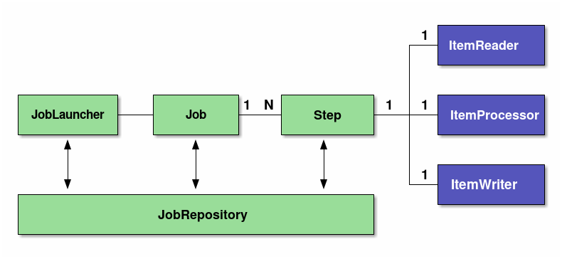

#  SpringBatch 코드 설명 및 아키텍처 알아보기

## Spring Batch 아키텍처

### 스프링 배치 모델

Spring Batch 는 Spring 의 특성을 그대로 가져왔다.

그래서 DI ,AOP ,서비스 추상화 등 Spring 프레임워크의 3대 요소를 모두 사용할 수 있다.

스프링 배치 모델은 다음과 같이 2가지 모델을 가진다. 

- Tasklet model
  - 단순한 처리 모델을 가지고 있으며, 로직 자체가 단순한 경우에 주로 사용한다.
  - 다양한 데이터소스나 파일을 한번에 처리해야 하는 경우 유연함이 있다.
  - Tasklet 인터페이스는 execute 메서드로 작업을 정의하고, 작업이 완료되면 RepeatStatus.FINISHED 를 반환하여 처리를 종료 한다.
```java
@Slf4j
public class GreetingTask implements Tasklet  {

    @Override
    public RepeatStatus execute(StepContribution contribution, ChunkContext chunkContext) throws Exception {
        log.info("------------------ Task Execute -----------------");
        log.info("GreetingTask: {}, {}", contribution, chunkContext);

        return RepeatStatus.FINISHED;
    }
}
```

- Chunk model
  - 데이터를 한 번에 하나씩 읽어 일정한 크기(chunk)로 모은 후, 이를 트랜잭션 경계 내에서 처리하는 방법이다.
  - 데이터를 일정한 수 만큼 읽고(ItemReader) , 처리 한 후 (ItemProcessor) ,마지막으로 기록(ItemWriter) 하는 순서로 진행 한다.
  - 데이터량이 매우 큰 경우 효과적으로 처리가 가능하다.


### 스프링 배치의 기본 아키텍처 

배치 처리는 읽기 -> 처리 -> 쓰기 흐름을 갖는다. 

- 읽기 (read) : 데이터 저장소 (일반적으로 데이터베이스) 에서 특정 데이터 레코드를 읽는다.
- 처리 (processing) : 원하는 방식으로 데이터 가공/처리 한다.
- 쓰기 (write) : 수정된 데이터를 다시 저장소(데이터베이스)에 저장한다.




- Job 과 Step 은 1:N
- Step 과 ItemReader , ItemProcessor , ItemWriter 는 1:1
- Job 이라는 하나의 큰 일감(Job)에 여러 단계 (Step)을 두고, 각 단계의 배치의 기본 흐름대로 구성한다.

#### <mark><i> Job </i></mark>

- Spring Batch 에서 일괄 적용을 위한 일련의 프로세스를 요약하는 단일 실행 단위 => 하나의 배치 작업 단위 
- Job 안에는  Step 이 존재하고, Step 안에 Tasklet 혹은 Reader & Processor & Writer 묶음이 존재한다.
- 스프링 배치 5.0 이전
  - JobBuilderFactory 로 원하는 Job 을 쉽게 만들 수 있다.
  - JobBuilderFactory 는 JobBuilder 를 생성할 수 있는 get() 메서드를 포함하고 있다. 
  - get() 메서드는 새로운 JobBuilder 를 생성해서 반환하는 것을 확인할 수 있다.
  - 코드 ( 출처 : jojoldu 님 코드)
```java
@Slf4j // log 사용을 위한 lombok 어노테이션
@RequiredArgsConstructor // 생성자 DI를 위한 lombok 어노테이션
@Configuration
public class SimpleJobConfiguration {
    private final JobBuilderFactory jobBuilderFactory;
    private final StepBuilderFactory stepBuilderFactory;

    @Bean
    public Job simpleJob() {
        return jobBuilderFactory.get("simpleJob")
                .start(simpleStep1())
                .build();
    }

    @Bean
    public Step simpleStep1() {
        return stepBuilderFactory.get("simpleStep1")
                .tasklet((contribution, chunkContext) -> {
                    log.info(">>>>> This is Step1");
                    return RepeatStatus.FINISHED;
                })
                .build();
    }
}
```

- 스프링 배치 5.0
  - JobBuilderFactory 는 deprecated 되었다.
  - 코드 (출처 : 교안 )
```java
@Slf4j
@Configuration
public class BasicTaskJobConfiguration {

    @Autowired
    PlatformTransactionManager transactionManager;

    @Bean
    public Tasklet greetingTasklet() {
        return new GreetingTask();
    }
    @Bean
    public Step step(JobRepository jobRepository, PlatformTransactionManager transactionManager) {
        log.info("------------------ Init myStep -----------------");

        return new StepBuilder("myStep", jobRepository)
                .tasklet(greetingTasklet(), transactionManager)
                .build();
    }

    @Bean
    public Job myJob(Step step, JobRepository jobRepository) {
        log.info("------------------ Init myJob -----------------");
        return new JobBuilder("myJob", jobRepository)
                .incrementer(new RunIdIncrementer())
                .start(step)
                .build();
    }
}
```

왜 Deprecated 되었을까❓❓

1. 명시적인 Job 및 Step 빌더 사용

**JobBuilderFactory** 를 사용하면 내부적으로 **JobRepository** 를 참조하게 되지만, 
이 참조가 코드상에서 명시적이지 않다. 5.0 에서는 **JobRepository** 를 직접 전달하여 어떤 리소스를 사용하는지 코드상에서 더 명확하게 보이도록 개선되었다.


JobBuilderFactory 코드 

```java
@Deprecated(
    since = "5.0.0",
    forRemoval = true
)
public class JobBuilderFactory {
    private final JobRepository jobRepository;

    public JobBuilderFactory(JobRepository jobRepository) {
        Assert.notNull(jobRepository, "JobRepository must not be null");
        this.jobRepository = jobRepository;
    }

    public JobBuilder get(String name) {
        return new JobBuilder(name, this.jobRepository);
    }
}

```

2. 의존성 주입 방식의 개선 

**JobBuilderFactory** 와 **StepBuilderFactory** 는 Spring Batch 에서 편리하게 Job 과 Step 을 빌드할 수 있도록 제공되었지만 ,
오히려 이로 인해 종속적인 Bean 으로 설정 되었다.
**JobRepository** 와 같은 구성 요소를 직접 주입하여 더 명시적이고 직관적인 코드를 작성할 수 있게 되었다.


=> 의존성 관리와 유지보수성을 강화하는 데 중점을 둔 개선이다 !!


#### <mark><i>Step</i></mark>

- Job 을 구성하는 처리 단위이다.
- Batch 비즈니스 로직을 처리하는 기능은 Step에 구현되어 있다.
- Step 에서는 Batch 로 실제 처리하고자 하는 기능과 설정을 모두 포함하는 장소라고 생각하면 된다. 
- 모든 Job에는 1개 이상의 Step이 있어야 한다.
- Job 과 동일하게 스프링 배치 5.0 이후로 StepBuilderFactory 는 deprecated 되었다.

StepBuilderFactory 코드

```java
@Deprecated(
    since = "5.0.0",
    forRemoval = true
)
public class StepBuilderFactory {
    private final JobRepository jobRepository;

    public StepBuilderFactory(JobRepository jobRepository) {
        Assert.notNull(jobRepository, "JobRepository must not be null");
        this.jobRepository = jobRepository;
    }

    public StepBuilder get(String name) {
        return new StepBuilder(name, this.jobRepository);
    }
}

```


#### <mark><i> JobLauncher</i></mark>

- Job 을 수행하기 위한 인터페이스이다.
- JobLauncher 는 사용자에 의해 직접 수행된다.
- 자바 커맨드를 통해서 CommandLineJobRunner 를 실행하여 단순하게 배치 프로세스가 수행될 수 있다.


#### <mark><i>  ItemReader </i></mark>

- Step 의 대상이 되는 배치 데이터를 읽어오는 인터페이스이다. 청크 단위 모델에서 사용한다. 
- File, Xml , DB 등 여러 타입의 데이터를 읽어 올 수 있다.

#### <mark><i> ItemProcessor </i></mark>

- 읽어들인 청크 데이터를 처리한다. 
- 데이터 변환을 수행하거나 , 데이터를 정제하는 등의 역할을 담당한다.
- 옵션으로 필요 없다면 사용하지 않아도 된다.

#### <mark><i>  ItemWriter </i></mark>

- 청크 데이터를 읽어들였거나 , 처리된 데이터를 실제 쓰기 작업을 담당한다. 
- 데이터베이스로 저장하거나, 수정하는 역할을 할 수 있고, 파일로 처리 결과를 출력할 수도 있다.

#### <mark><i> JobRepository </i></mark>

- Job 과 Step 의 상태를 관리하는 시스템이다.
- 스프링 배치에서 사용하는 테이블 스키마를 기반으로 상태정보를 저장하고 관리한다.


## 실습

### Tasklet 구현체 생성

```java
@Slf4j
public class GreetingTask implements Tasklet , InitializingBean {

    @Override
    public RepeatStatus execute(StepContribution contribution, ChunkContext chunkContext) throws Exception {
        log.info("------------------ Task Execute -----------------");
        log.info("GreetingTask: {}, {}", contribution, chunkContext);

        return RepeatStatus.FINISHED;
    }

    @Override
    public void afterPropertiesSet() throws Exception {
        log.info("----------------- After Properites Sets() --------------");
    }
}
```
- Tasklet 인터페이스는 execute 메서드로 작업을 정의한다.
- 파라미터로 StepContribution 과 ChunkContext 를 받는다.
- 최종적으로 RepeatStatus 를 반환한다. 
  - FINISHED : 태스크릿이 종료되었음을 나타낸다. 
  - CONTINUABLE : 계속해서 태스크를 수행하도록 한다. 
  - continueif(condition) : 조건에 따라 종료할지 지속할지 결정하는 메소드에 따라 종료/지속을 결정한다.


### Job , Step 생성

```java
@Slf4j
@Configuration
public class BasicTaskJobConfiguration {

    @Autowired
    PlatformTransactionManager transactionManager;

    @Bean
    public Tasklet greetingTasklet() {
        return new GreetingTask();
    }
    @Bean
    public Step step(JobRepository jobRepository, PlatformTransactionManager transactionManager) {
        log.info("------------------ Init myStep -----------------");

        return new StepBuilder("myStep", jobRepository)
                .tasklet(greetingTasklet(), transactionManager)
                .build();
    }

    @Bean
    public Job myJob(Step step, JobRepository jobRepository) {
        log.info("------------------ Init myJob -----------------");
        return new JobBuilder("myJob", jobRepository)
                .incrementer(new RunIdIncrementer())
                .start(step)
                .build();
    }
}
```

Step 정의

- StepBuilder 를 사용하여 Step 정의 한다.
- StepBuilder 에서 tasklet() 메서드를 호출하여 Tasklet 을 설정한다.
- transactionManager 를 사용해 트랜잭션 처리를 추가한다. 

Job 정의

- JobBuilder 를 사용하여 Job 을 정의한다.
- RunIdIncrementer 는 Spring Batch 에서 제공하는 기본적인 JobParametersIncrementer 구현체로 Job 이 실행될 때 마다 고유한 Run ID 를 생성해준다.
- Spring Batch 에서는 동일 파라미터인데 다시 실행하고 싶을때 사용하라는 의미로 RunIncrementer 를 제공한다. 


### 실행 결과

DB 를 조회해보자

#### BATCH_JOB_EXECUTION


#### BATCH_JOB_INSTANCE


## 참고

https://devocean.sk.com/blog/techBoardDetail.do?ID=166690
https://cheese10yun.github.io/spring-batch-basic/#undefined
https://jojoldu.tistory.com/328?category=902551
https://docs.spring.io/spring-batch/reference/#what-is-new