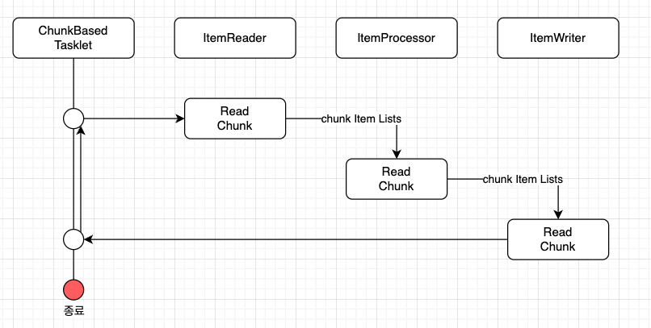

# Spring Batch ChunkModel 과 Tasklet 모델

## Chunk Model 알아보기 

- Chunk Model 은 처리할 데이터를 일정단위(청크)로 처리하는 방식이다.
- ChunkOrientedTasklet 은 청크 처리를 지원하는 Tasklet 의 구체적인 클래스 역할을 수행한다. 
- 청크에 포함될 데이터의 최대 레코드 수(청크 size) 는 본 클래스의 commit-interval 이라는 설정 값을 이용하여 조정이 가능하다.
- ItemReader , ItemProcessor , ItemWriter 는 청크 단위를 처리하기 위한 인터페이스 이다.

- 위 시퀀스 다이어그램과 같이 ChunkOrientedTasklet 은 ItemReader , ItemProcessor , ItemWriter 구현체를 각각 호출한다.
- 이때 ChunkOrientedTasklet 은 청크 단위에 따라 ItemReader , ItemProcessor , ItemWriter 를 반복실행한다.
- 청크 크기만큼 ItemReader 가 데이터를 읽어 들인다.
- 청크 단위를 ItemProcessor 로 전달하고, 데이터를 처리한다. 
- ItemProcessor 를 처리하고난 청크 단위가 ItemWriter 로 전달되어 데이터를 저장하거나, 파일처리를 수행한다.

### ItemReader 

- ItemReader 는 Step의 대상이 되는 배치 데이터를 읽어오는 인어페이스이다. File, Xml , Db 등 여러 타입의 데이터를 읽어올 수 있다.
- ItemReader 는 직접 커스텀 구현을 할 수 있지만, 스프링 배치에서는 이미 구현된 다양한 ItemReader 구현체를 제공한다.

#### 제공하는 다양한 구현체 

- FlatFileItemReader
  - 플랫파일 (구조화 되지 않는 파일을 플랫파일이라도 한다.) 을 읽어 들인다.
  - 대표적인 것이 CSV 파일 등이 있다.
  - 읽어들인 데이터를 객체로 매핑하기 위해서 delimeter 를 기준으로 매핑 룰을 이용하여 객체로 매핑한다.
  - 혹은 입력에 대해서 Resource object 를 커스텀하게 매핑할 수도 있다.
- StatEvenItemReader
  - XML파일을 읽어 들인다.
  - 이름이 함축하듯이 XML 파일을 Stax 기반으로 읽어 들인다.
- JdbcPagingItemReader / JdbcCursorItemReader
  - JDBC를 사용하여 SQL 을 실행하고 데이터베이스의 레코드를 읽는다.
  - 데이터베이스에서 많은 양의 데이터를 처리해야 하는 경우에는 메모리에 있는 모든 레코드를 읽는 것을 피하고, 한 번의 처리에 필요한 데이터만 읽고 폐기하는 것이 필요하다.
  - JdbcPagingItemReader 는 JdbcTemplate 을 이용하여 각 페이지에 대한 SELECT SQL을 나누어 처리하는 방식으로 구현된다.
  - 반면 JdbcCursorItemReader 는 JDBC 커서를 이용하여 하나의 SELECT SQL을 발행하여 구현된다.
- MyBatisCursorItemReader / MyBatisPagingItemReader
  - MyBatis를 사용하여 데이터베이스의 레코드를 읽는다.
  - MyBatis가 제공하는 Spring 의 조정 라이브러리는 MyBatis-Spring 에서 제공된다. 
  - Paging 과 Cursor 의 차이점은 MyBatis 구현방법이 다를 뿐이지 JdbcXXXItemReader 과 동일하다.
  - 또한 ItemReaderJPA 구현이나 Hibernate 와 연동하여 데이터베이스의 레코드를 읽어오는 JpaPagingItemReader , HibernatePagingItemReader , HibernateCursor 를 제공한다.
- JmsItemReader / AmqpItemReader
  - 메시지를 JMS 혹은 AMQP 에서 읽어들인다.

### ItemProcessor 

- ItemProcessor 은 구체적인 구현체를 구현하여 스프링배치에 전달한다.
- ItemProcessor 은 Reader로 읽어들인 청크 데이터들을 처리한다. 처리라고 하면, 데이터를 변환하거나 , 
데이터에 변경 혹은 외부 인터페이스 호출등을 수행하는 역할을 한다.
- ItemProcessor 는 chunk model에서 없어도 되는 옵션이다.
- ItemReader 와 마찬가지로 Spring Batch 에는 다양한 ItemProcessor 구현체도 제공한다.

#### 제공되는 다양한 구현체

- PassThroughItemProcessor
  - 아무 작업도 수행하지 않는다.
  - 입력된 데이터의 변경이나 처리가 필요하지 않는 경우 사용된다.
- ValidatingItemProcessor
  - 입력된 데이터를 체크한다.
  - 입력 확인 규칙을 구현하려면 Spring Batch 전용 org.springframework.batch.item.validator.Validator 를 구현해야 한다.
  - 그러나 일반적인 org.springframework.validation.Validator 의 어댑터인 SpringValidator 와 org.springframework.validation 의 규칙을 제공한다.

### ItemWriter 

- ItemWriter 는 배치 데이터를 저장한다.  일반적으로 DB나 파일에 저장한다.
- ItemWriter 역시 다양한 구현체를 제공한다.

#### 제공되는 다양한 구현체

- FlatFileItemWriter
  - 처리된 Java 객체를 CSV 파일과 같은 플랫 파일로 작성한다.
  - 파일 라인에 대한 매핑 규칙은 구분 기호 및 개체에서 사용자 정의로 사용할수도 있다.
- StaxEvenItemWriter
  - XML파일로 자바 객체를 쓰기할 수 있다.
- JdbcBatchItemWriter
  - JDBC를 사용하여 SQL을 수행하고 자바 객체를 데이터베이스에 쓰기한다.
  - 내부적으로 JdbcTemplate 를 사용하게 된다.
- MyBatisBatchItemWriter
  - Mybatis 를 사용하여 자바 객체를 데이터베이스에 쓰기한다.
  - MyBatis-Spring 은 MyBatis에 의해서 제공되는 라이브러리를 이용한다.
- JmsItemWriter / AmqpItemWriter 
  - JMS 혹은 AMQP 로 자바 객체의 메시지를 전송한다.

  
## Tasklet Model

- chunk model 은 큰 데이터를 분할해서 ItemReader -> ItemProcessor -> ItemWriter 순으로 처리가 필요한 경우 매우 유용하다.
- 반면 청크 단위의 처리가 딱 맞지 않을 경우 Tasklet Model 이 유용하다.
- 예를 들어 한번에 하나의 레코드만 읽어서 쓰기해야 하는 경우 Tasklet Model이 적합하다. 
- 사용자는 Tasklet 모델을 사용하면서 Spring Batch 에서 제공하는 Tasklet 인터페이스를 구현해야 한다. 

### Tasklet 구현클래스

- SystemCommandTasklet
  - 시스템 명령어를 비동기적으로 실행하는 Tasklet 이다.
  - 명령 속성에 수행해야할 명령어를 지정하여 사용할 수 있다.
  - 시스템 명령은 호출하는 스레드와 다른 스레드에 의해 실행되므로 프로세스 도중 타임아웃을 설정하고, 시스템 명령의 실행 스레드를 취소할 수 있다.
- MethodInvokingTaskletAdapter 
  - POJO클래스의 특정 메소드를 실행하기 위한 태스클릿이다.
  - targetObject 속성에 대상 클래스의 빈을 지정하고, targetMethod 속성에 실행할 메소드 이름을 지정한다.
  - POJO 클래스는 일괄 처리 종료 상태를 메소드의 반환 값으로 반환이 가능하지만, 이경우 사실은 ExitStatus 를 반환값으로 설정해야 한다.
  - 디른 타입의 값이 반환될 경우 반환값과 상관없이 "정상 종료(ExitStatus : COMPLETED) " 상태로 간주된다.

## 실습

### 휴면 회원 베치 구현 