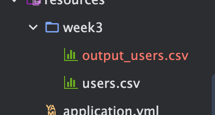
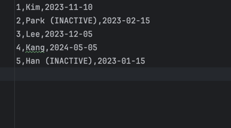

# Spring Batch ChunkModel 과 Tasklet 모델

## Chunk Model 알아보기 

- Chunk Model 은 처리할 데이터를 일정단위(청크)로 처리하는 방식이다.
- ChunkOrientedTasklet 은 청크 처리를 지원하는 Tasklet 의 구체적인 클래스 역할을 수행한다. 
- 청크에 포함될 데이터의 최대 레코드 수(청크 size) 는 본 클래스의 commit-interval 이라는 설정 값을 이용하여 조정이 가능하다.
- ItemReader , ItemProcessor , ItemWriter 는 청크 단위를 처리하기 위한 인터페이스 이다.


- 위 시퀀스 다이어그램과 같이 ChunkOrientedTasklet 은 ItemReader , ItemProcessor , ItemWriter 구현체를 각각 호출한다.
- 이때 ChunkOrientedTasklet 은 청크 단위에 따라 ItemReader , ItemProcessor , ItemWriter 를 반복실행한다.
- 청크 크기만큼 ItemReader 가 데이터를 읽어 들인다.
- 청크 단위를 ItemProcessor 로 전달하고, 데이터를 처리한다. 
- ItemProcessor 를 처리하고난 청크 단위가 ItemWriter 로 전달되어 데이터를 저장하거나, 파일처리를 수행한다.


### ItemReader 

- ItemReader 는 Step의 대상이 되는 배치 데이터를 읽어오는 인어페이스이다. File, Xml , Db 등 여러 타입의 데이터를 읽어올 수 있다.
- ItemReader 는 직접 커스텀 구현을 할 수 있지만, 스프링 배치에서는 이미 구현된 다양한 ItemReader 구현체를 제공한다.

#### 제공하는 다양한 구현체 

- FlatFileItemReader
  - 플랫파일 (구조화 되지 않는 파일을 플랫파일이라도 한다.) 을 읽어 들인다.
  - 대표적인 것이 CSV 파일 등이 있다.
  - 읽어들인 데이터를 객체로 매핑하기 위해서 delimeter 를 기준으로 매핑 룰을 이용하여 객체로 매핑한다.
  - 혹은 입력에 대해서 Resource object 를 커스텀하게 매핑할 수도 있다.
- StatEvenItemReader
  - XML파일을 읽어 들인다.
  - 이름이 함축하듯이 XML 파일을 Stax 기반으로 읽어 들인다.
- JdbcPagingItemReader / JdbcCursorItemReader
  - JDBC를 사용하여 SQL 을 실행하고 데이터베이스의 레코드를 읽는다.
  - 데이터베이스에서 많은 양의 데이터를 처리해야 하는 경우에는 메모리에 있는 모든 레코드를 읽는 것을 피하고, 한 번의 처리에 필요한 데이터만 읽고 폐기하는 것이 필요하다.
  - JdbcPagingItemReader 는 JdbcTemplate 을 이용하여 각 페이지에 대한 SELECT SQL을 나누어 처리하는 방식으로 구현된다.
  - 반면 JdbcCursorItemReader 는 JDBC 커서를 이용하여 하나의 SELECT SQL을 발행하여 구현된다.
- MyBatisCursorItemReader / MyBatisPagingItemReader
  - MyBatis를 사용하여 데이터베이스의 레코드를 읽는다.
  - MyBatis가 제공하는 Spring 의 조정 라이브러리는 MyBatis-Spring 에서 제공된다. 
  - Paging 과 Cursor 의 차이점은 MyBatis 구현방법이 다를 뿐이지 JdbcXXXItemReader 과 동일하다.
  - 또한 ItemReaderJPA 구현이나 Hibernate 와 연동하여 데이터베이스의 레코드를 읽어오는 JpaPagingItemReader , HibernatePagingItemReader , HibernateCursor 를 제공한다.
- JmsItemReader / AmqpItemReader
  - 메시지를 JMS 혹은 AMQP 에서 읽어들인다.


### ItemProcessor 

- ItemProcessor 은 구체적인 구현체를 구현하여 스프링배치에 전달한다.
- ItemProcessor 은 Reader로 읽어들인 청크 데이터들을 처리한다. 처리라고 하면, 데이터를 변환하거나 , 
데이터에 변경 혹은 외부 인터페이스 호출등을 수행하는 역할을 한다.
- ItemProcessor 는 chunk model에서 없어도 되는 옵션이다.
- ItemReader 와 마찬가지로 Spring Batch 에는 다양한 ItemProcessor 구현체도 제공한다.

#### 제공되는 다양한 구현체

- PassThroughItemProcessor
  - 아무 작업도 수행하지 않는다.
  - 입력된 데이터의 변경이나 처리가 필요하지 않는 경우 사용된다.
- ValidatingItemProcessor
  - 입력된 데이터를 체크한다.
  - 입력 확인 규칙을 구현하려면 Spring Batch 전용 org.springframework.batch.item.validator.Validator 를 구현해야 한다.
  - 그러나 일반적인 org.springframework.validation.Validator 의 어댑터인 SpringValidator 와 org.springframework.validation 의 규칙을 제공한다.


### ItemWriter 

- ItemWriter 는 배치 데이터를 저장한다.  일반적으로 DB나 파일에 저장한다.
- ItemWriter 역시 다양한 구현체를 제공한다.

#### 제공되는 다양한 구현체

- FlatFileItemWriter
  - 처리된 Java 객체를 CSV 파일과 같은 플랫 파일로 작성한다.
  - 파일 라인에 대한 매핑 규칙은 구분 기호 및 개체에서 사용자 정의로 사용할수도 있다.
- StaxEvenItemWriter
  - XML파일로 자바 객체를 쓰기할 수 있다.
- JdbcBatchItemWriter
  - JDBC를 사용하여 SQL을 수행하고 자바 객체를 데이터베이스에 쓰기한다.
  - 내부적으로 JdbcTemplate 를 사용하게 된다.
- MyBatisBatchItemWriter
  - Mybatis 를 사용하여 자바 객체를 데이터베이스에 쓰기한다.
  - MyBatis-Spring 은 MyBatis에 의해서 제공되는 라이브러리를 이용한다.
- JmsItemWriter / AmqpItemWriter 
  - JMS 혹은 AMQP 로 자바 객체의 메시지를 전송한다.


  
## Tasklet Model

- chunk model 은 큰 데이터를 분할해서 ItemReader -> ItemProcessor -> ItemWriter 순으로 처리가 필요한 경우 매우 유용하다.
- 반면 청크 단위의 처리가 딱 맞지 않을 경우 Tasklet Model 이 유용하다.
- 예를 들어 한번에 하나의 레코드만 읽어서 쓰기해야 하는 경우 Tasklet Model이 적합하다. 
- 사용자는 Tasklet 모델을 사용하면서 Spring Batch 에서 제공하는 Tasklet 인터페이스를 구현해야 한다. 


### Tasklet 구현클래스

- SystemCommandTasklet
  - 시스템 명령어를 비동기적으로 실행하는 Tasklet 이다.
  - 명령 속성에 수행해야할 명령어를 지정하여 사용할 수 있다.
  - 시스템 명령은 호출하는 스레드와 다른 스레드에 의해 실행되므로 프로세스 도중 타임아웃을 설정하고, 시스템 명령의 실행 스레드를 취소할 수 있다.
- MethodInvokingTaskletAdapter 
  - POJO클래스의 특정 메소드를 실행하기 위한 태스클릿이다.
  - targetObject 속성에 대상 클래스의 빈을 지정하고, targetMethod 속성에 실행할 메소드 이름을 지정한다.
  - POJO 클래스는 일괄 처리 종료 상태를 메소드의 반환 값으로 반환이 가능하지만, 이경우 사실은 ExitStatus 를 반환값으로 설정해야 한다.
  - 디른 타입의 값이 반환될 경우 반환값과 상관없이 "정상 종료(ExitStatus : COMPLETED) " 상태로 간주된다.


## 실습

### 휴면 회원 베치 구현 

가입한 회원 중 1년이 지나도록 상태 변화가 없는 회원을 휴면 회원으로 전환

User

회원정보는 csv 파일에 저장

```csv
id,name,last_update
1,Kim,2023-11-10
2,Park,2023-02-15
3,Lee,2023-12-05
4,Kang,2024-05-05
5,Han,2023-01-15
```


#### CSV 파일 처리를 위한 User 객체 


```java
@Data
public class User {
    private Long id;
    private String name;
    @DateTimeFormat(pattern = "yyyy-MM-dd")
    private LocalDate lastUpdate;
}

```

#### Reader 구현 

CsvBatchJobConfig.java

```java
   @Bean
    public FlatFileItemReader<User> csvReader() {
        return new FlatFileItemReaderBuilder<User>()
                .name("userCsvReader")
                .resource(new FileSystemResource("src/main/resources/week3/users.csv"))
                .linesToSkip(1)
                .delimited()
                .names(new String[] { "id", "name", "lastUpdate" })
                .lineMapper(userLineMapper()) // lineMapper 메서드 호출
                .build();
    }

```

- name : 이름 설정
- resources :  CSV 파일 경로 지정
- linesToSkip(1) : CSV 파일의 첫 번째 줄을 건너 뛴다.
- delimited(): CSV 파일을 구분자(콤마)로 나누어 각 값을 필드로 인식하도록 합니다.
- names: CSV 파일에서 읽어들일 컬럼 이름을 지정합니다.
- lineMapper: 각 라인을 User 객체로 변환하는 매퍼를 설정합니다.


```java
 private LineMapper<User> userLineMapper() {
  DefaultLineMapper<User> lineMapper = new DefaultLineMapper<>();

  DelimitedLineTokenizer lineTokenizer = new DelimitedLineTokenizer();
  lineTokenizer.setNames("id", "name", "lastUpdate");

  lineMapper.setLineTokenizer(lineTokenizer);
  lineMapper.setFieldSetMapper(new FieldSetMapper<User>() {
    @Override
    public User mapFieldSet(FieldSet fieldSet) throws BindException {
      User user = new User();
      user.setId(fieldSet.readLong("id")); // id를 Long으로 읽어옴
      user.setName(fieldSet.readString("name")); // name을 String으로 읽어옴
      user.setLastUpdate(LocalDate.parse(fieldSet.readString("lastUpdate"), DateTimeFormatter.ofPattern("yyyy-MM-dd"))); // lastUpdate를 LocalDate로 파싱
      return user;
    }
  });

  return lineMapper;
}
```

- userLineMapper() 메서드는 CSV 파일의 각 라인을 User 객체에 매핑하는 기능을 제공한다.
- DelimitedLineTokenizer: CSV 파일에서 데이터를 토큰화하여 "id", "name", "lastUpdate" 컬럼을 인식한다.
- FieldSetMapper: 각 토큰을 User 객체의 속성으로 매핑한다.


#### Processor 구현

UserItemProcessor.java

```java
public class UserItemProcessor implements ItemProcessor<User, User> {

    @Override
    public User process(User user) throws Exception {
        // 현재 날짜에서 1년 전 날짜를 계산
        LocalDate oneYearAgo = LocalDate.now().minusYears(1);

        // user의 lastUpdate가 1년 전 날짜보다 이전인지 확인
        if (user.getLastUpdate().isBefore(oneYearAgo)) {
            user.setName(user.getName() + " (INACTIVE)");
        }
        return user;
    }
}
```

현재 날짜에서 1년 이전의 회원인지 확인하고, 해당하는 회원의 이름을 "(INACTIVE)"로 변경한다


#### Writer 구현

UserItemWriter.java

````java
@Slf4j
public class UserItemWriter extends FlatFileItemWriter<User> {

    public UserItemWriter() {
        setResource(new FileSystemResource("src/main/resources/week3/output_users.csv"));
        setAppendAllowed(true); // 파일에 데이터를 추가할 수 있도록 설정
        setLineAggregator(new LineAggregator<User>() {
            @Override
            public String aggregate(User user) {
                return String.format("%d,%s,%s",
                        user.getId(),
                        user.getName(),
                        user.getLastUpdate().format(DateTimeFormatter.ofPattern("yyyy-MM-dd")));
            }
        });
    }
}
````

- 처리된 User 객체를 output_users 이름의 csv 파일로 출력한다.

#### Job & Step

````java
   @Bean
    public Job csvJob(Step csvStep) {
        return new JobBuilder("csvJob", jobRepository)
                .incrementer(new RunIdIncrementer())
                .start(csvStep)
                .build();
    }

    @Bean
    public Step csvStep() {
        return new StepBuilder("csvStep", jobRepository)
                .<User, User>chunk(10 ,transactionManager)
                .reader(csvReader())
                .processor(new UserItemProcessor())
                .writer(new UserItemWriter())
                .build();
    }
````


*Job*

- 전체 베치 작업을 정의하는 요소 
- JobBuilder: 배치 작업의 이름을 설정하고, jobRepository를 통해 상태를 관리한다.
- incrementer: 배치 작업 실행 시 고유한 ID를 생성하는 RunIdIncrementer를 사용한다.
- start: 이 배치 작업에서 시작할 Step을 지정한다.

*Step*

- StepBuilder: 단계의 이름을 설정하고, jobRepository를 통해 단계를 관리한다.
- chunk: 한 번에 처리할 데이터의 덩어리 크기를 설정한다.
- reader: csvReader()에서 정의된 리더를 사용하여 데이터를 읽는다.
- processor: UserItemProcessor를 사용하여 데이터를 처리한다.
- writer: UserItemWriter를 사용하여 데이터를 기록한다.

#### 구성 클래스

````java
@Slf4j
@Configuration
public class CsvBatchJobConfig {

    @Autowired
    private PlatformTransactionManager transactionManager;

    @Autowired
    private JobRepository jobRepository;


    private LineMapper<User> userLineMapper() {
        DefaultLineMapper<User> lineMapper = new DefaultLineMapper<>();

        DelimitedLineTokenizer lineTokenizer = new DelimitedLineTokenizer();
        lineTokenizer.setNames("id", "name", "lastUpdate");

        lineMapper.setLineTokenizer(lineTokenizer);
        lineMapper.setFieldSetMapper(new FieldSetMapper<User>() {
            @Override
            public User mapFieldSet(FieldSet fieldSet) throws BindException {
                User user = new User();
                user.setId(fieldSet.readLong("id")); // id를 Long으로 읽어옴
                user.setName(fieldSet.readString("name")); // name을 String으로 읽어옴
                user.setLastUpdate(LocalDate.parse(fieldSet.readString("lastUpdate"), DateTimeFormatter.ofPattern("yyyy-MM-dd"))); // lastUpdate를 LocalDate로 파싱
                return user;
            }
        });

        return lineMapper;
    }

    @Bean
    public FlatFileItemReader<User> csvReader() {
        return new FlatFileItemReaderBuilder<User>()
                .name("userCsvReader")
                .resource(new FileSystemResource("src/main/resources/week3/users.csv"))
                .linesToSkip(1)
                .delimited()
                .names(new String[] { "id", "name", "lastUpdate" })
                .lineMapper(userLineMapper()) // lineMapper 메서드 호출
                .build();
    }


    @Bean
    public Job csvJob(Step csvStep) {
        return new JobBuilder("csvJob", jobRepository)
                .incrementer(new RunIdIncrementer())
                .start(csvStep)
                .build();
    }

    @Bean
    public Step csvStep() {
        return new StepBuilder("csvStep", jobRepository)
                .<User, User>chunk(10 ,transactionManager)
                .reader(csvReader())
                .processor(new UserItemProcessor())
                .writer(new UserItemWriter())
                .build();
    }
}

````

#### 실행


결과 




output_users.csv 

