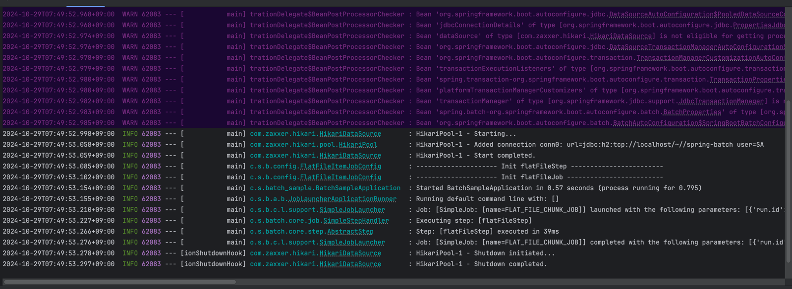

# FlatFileItemReader 로 단순 파일 읽고, FlatFileItemWriter 로 파일에 쓰기

## FlatFileItemReader 개요

- FlatFileItemReader 는 SpringBatch 에서 제공하는 기본적인 ItemReader 로 , 텍스트 파일로부터 데이터를 읽는다.
- 고정 길이, 구분자 기반, 멀티라인 등 다양한 형식의 텍스트 파일을 지원하며, 다음과 같은 장점을 가진다.
- 간단하고 효율적인 구현 : 설정 및 사용이 간편하며, 대규모 데이터 처리에도 효율적이다.
- 다양한 텍스트 파일 형식 지원 : 고정 길이, 구분자 기반, 멀티라인 등 다양한 형식의 텍스트 파일을 읽을 수 있다.
- 확장 가능성 : 토크나이저, 필터 등을 통해 기능을 확장할 수 있다.
- 사용처 : 고정 길이 , 구분자 기반, 멀티라인 등 다양한 형식의 텍스트 파일 데이터 처리 

### 장점 : 간단하고 효율적인 구현, 다양한 텍스트 파일 형식 지원


### 단점 : 복잡한 데이터 구조 처리에는 적합하지 않음


## FlatFileItemReader 주요 구성 요소

- Resource : 읽을 텍스트 파일을 지정한다.
- LineMapper : 텍스프 파일의 각 라인을 Item으로 변환하는 역할을 한다.
- LineTokenizer : 텍스트 파일의 각 라인을 토큰으로 분리하는 역할을 한다.
- FieldSetMapper : 토큰을 Item 의 속성에 매핑하는 역할을 한다.
- SkippableLineMapper : 오류 발생 시 해당 라인을 건너뛸 수 있도록 한다.
- ReadListener : 읽기 시작, 종료, 오류 발생 등의 이벤트를 처리할 수 있도로 한다.

## 샘플코드

### Customer 모델 생성하기

```java
@Getter
@Setter
public class Customer {
    
    private String name;
    private int age;
    private String gender;
}

```

- 읽어들인 정보를 Customer 객체에 매핑할 수 있도록 객체를 정의한다.


### FlatFileItemReader 빈 생성

- FlatFileItemReader 를 생성하고, Customer 객체에 등록하여 반환한다.

```java
public class FlatFileItemJobConfig {
    
    @Bean
    public FlatFileItemReader<Customer> flatFileItemReader() {
        return new FlatFileItemReaderBuilder<Customer>()
                .name("FlatFileItemReader")
                .resource(new ClassPathResource("./customers.csv"))
                .encoding(ENCODING)
                .delimited().delimiter(",")
                .names("name","age","gender")
                .targetType(Customer.class)
                .build();
    }
}
```

- resource
  - ClassPathResource("./customer.csv")
  - 클래스 패스 내부에 존재하는 csv 파일을 읽어들인다.
- encoding
  - 파일 데이터의 인코딩을 추가한다.
- delimited
  - 구분자로 설정되어 있음을 의미한다.
- delimiter
  - 구분자를 무엇으로 할지 지정한다.
- names
  - 구분자로 구분된 데이터의 이름을 지정한다.
- targetType
  - 구분된 데이터를 어느 모델에 넣을지 클래스 타입을 지정한다.


## FlatFileItemWriter 개요

- FlatFileItemWriter 는 Spring Batch 에서 제공하는 ItemWriter 인터페이스를 구현한 클래스이다.
- 데이터를 텍스트 파일로 출력하는 데 사용된다.


## FlatFileItemWriter 구성 요소

- Resource : 출력 파일 경로를 지정한다.
- LineAggregator : Item 을 문자열로 변환하는 역할을 한다.
- HeaderCallback : 출력 파일 헤더를 작성하는 역할을 한다.
- FooterCallback : 출력 파일 푸터를 작성하는 역할을 한다. 
- Delimiter : 항목 사이 구분자를 지정한다.
- AppendMode :기존 파일에 추가할지 여부를 지정한다.

### 장점

- 간편성 : 텍스트 파일로 데이터를 출력하는 간편한 방법을 제공한다. 
- 유연성 : 다양한 설정을 통해 원하는 형식으로 출력 파일을 만들 수 있다.
- 성능 : 대량의 데이터를 빠르게 출력할 수 있다.

### 단점

- 형식 제약 : 텍스트 파일 형식만 지원한다.
- 복잡한 구조 : 복잡한 구조의 데이터를 출력할 경우 설정이 복잡해질 수 있다.
- 오류 가능성 : 설정 오류 시 출력 파일이 손상될 수 있다.


### FlatFileItemWriter 빈 생성

````java
@Bean
public FlatFileItemWriter<Customer> flatFileItemWriter() {
  return new FlatFileItemWriterBuilder<Customer>()
          .name("flatFileItemWriter")
          .resource(new FileSystemResource("./output/customer_new.csv"))
          .encoding(ENCODING)
          .delimited().delimiter("\t")
          .names("Name","Age","Gender")
          .append(false)
          .lineAggregator(new CustomerLineAggregator())
          .headerCallback(new CustomerHeader())
          .footerCallback(new CustomerFooter(aggregateInfos))
          .build();
}
````

- FlatFileItemWriterBuilder : 파일로 결과를 쓰게하기 위한 빌더 객체
- name : FlatFileItemWriter 의 이름을 지정한다.
- resource : 저장할 최종 파일 이름
- encoding : 저장할 파일의 인코딩 타입
- delimited().delimiter : 각 필드를 구분할 딜리미터를 지정한다. 
- append : true 인 경우 기존 파일에 첨부한다. false 인 경우 새로운 파일을 만든다.
- lineAggregator : 라인 구분자를 지정한다.
- headerCallback : 출력 파일의 헤더를 지정할 수 있도록 한다.
- footerCallback : 출력 파일의 푸터를 지정할 수 있도록 한다.


### CustomerLineAggregator 작성하기

```java
public class CustomerLineAggregator implements LineAggregator<Customer> {
    @Override
    public String aggregate(Customer item) {
        return item.getName() + "," + item.getAge();
    }
}
```

- LieAggregator 는 FlatFile에 저장할 아이템들을 스트링으로 변환하는 방법을 지정하는 것이다.
- 위와 같이 aggregate 를 구현하여 아이템을 스트링 문자로 변경하는 것을 확인할 수 있다.

### CustomerHeader 작성하기

```java
public class CustomerHeader implements FlatFileHeaderCallback {
    @Override
    public void writeHeader(Writer writer) throws IOException {
        writer.write("ID,AGE");
    }
}
```

- FlatFileHeaderCallback 은 writeHeader 를 구현하고 , 출력될 파일의 헤더를 달아주는 역할을 한다.

### CustomerFooter 작성하기

```java
public class CustomerFooter implements FlatFileFooterCallback {

  ConcurrentHashMap<String, Integer> aggregateCustomers;

  public CustomerFooter(ConcurrentHashMap<String, Integer> aggregateCustomers) {
    this.aggregateCustomers = aggregateCustomers;
  }

  @Override
  public void writeFooter(Writer writer) throws IOException {
    writer.write("총 고객 수: " + aggregateCustomers.get("TOTAL_CUSTOMERS"));

    writer.write(System.lineSeparator());
    writer.write("총 나이: " + aggregateCustomers.get("TOTAL_AGES"));
  }
}
```

- FlatFileFooterCallback 은 푸터를 작성할 때 사용한다. 
- 결과를 집계하여 총 고객수와 총 나이를 출력한다.

### AggregateCustomerProcessor 작성하기

```java
public class AggregateCustomerProcessor implements ItemProcessor<Customer, Customer> {
    
    ConcurrentHashMap<String , Integer> aggregateCustomers;

    public AggregateCustomerProcessor(ConcurrentHashMap<String, Integer> aggregateCustomers) {
        this.aggregateCustomers = aggregateCustomers;
    }

    @Override
    public Customer process(Customer item) throws Exception {
        aggregateCustomers.putIfAbsent("TOTAL_CUSTOMERS",0);
        aggregateCustomers.putIfAbsent("TOTAL_AGES",0);
        
        aggregateCustomers.put("TOTAL_CUSTOMERS", aggregateCustomers.get("TOTAL_CUSTOMERS") + 1);
        aggregateCustomers.put("TOTAL_AGES", aggregateCustomers.get("TOTAL_AGES") + item.getAge());
        return item;
    }
}
```

- ItemProcessor 는 process 메소드를 구현하였으며, 각 아이템을 하나씩 읽고 아이템의 내용을 집계하고 있다.


## 샘플코드 전체 소스

````java
@Slf4j
@Configuration
public class FlatFileItemJobConfig {

  public static final int CHUNK_SIZE = 100;
  public static final String ENCODING = "UTF-8";
  public static final String FLAT_FILE_CHUNK_JOB = "FLAT_FILE_CHUNK_JOB";

  private ConcurrentHashMap<String , Integer> aggregateInfos = new ConcurrentHashMap<>();

  private final ItemProcessor<Customer, Customer> itemProcessor = new AggregateCustomerProcessor(aggregateInfos);


  @Bean
  public FlatFileItemReader<Customer> flatFileItemReader() {
    return new FlatFileItemReaderBuilder<Customer>()
            .name("FlatFileItemReader")
            .resource(new ClassPathResource("./customers.csv"))
            .encoding(ENCODING)
            .delimited().delimiter(",")
            .names("name","age","gender")
            .targetType(Customer.class)
            .build();
  }

  @Bean
  public FlatFileItemWriter<Customer> flatFileItemWriter() {
    return new FlatFileItemWriterBuilder<Customer>()
            .name("flatFileItemWriter")
            .resource(new FileSystemResource("./output/customer_new.csv"))
            .encoding(ENCODING)
            .delimited().delimiter("\t")
            .names("Name","Age","Gender")
            .append(false)
            .lineAggregator(new CustomerLineAggregator())
            .headerCallback(new CustomerHeader())
            .footerCallback(new CustomerFooter(aggregateInfos))
            .build();
  }

  @Bean
  public Step flatFileStep(JobRepository jobRepository , PlatformTransactionManager transactionManager) {
    log.info("--------------------- Init flatFileStep ------------------------");

    return new StepBuilder("flatFileStep" , jobRepository)
            .<Customer,Customer>chunk(CHUNK_SIZE, transactionManager)
            .reader(flatFileItemReader())
            .processor(itemProcessor)
            .writer(flatFileItemWriter())
            .build();
  }

  @Bean
  public Job flatFileJob(Step flatFileStep , JobRepository jobRepository) {
    log.info("--------------------- Init flatFileJob -------------------------");

    return new JobBuilder(FLAT_FILE_CHUNK_JOB , jobRepository)
            .incrementer(new RunIdIncrementer())
            .start(flatFileStep)
            .build();
  }

}
````

## 실습

### customers.csv 파일 생성

```csv
name,age,gender
Kim,29,Male
Park,22,Female
Bae,35,Male
Ko,27,Male
Hong,20,Female
Song,25,Female
Lee,31,Male
```

csv 파일의 위치는 어디에?

```java
resource(new ClassPathResource("./customers.csv"))
```

ClassPathResource 는  Spring Framework 에서 클래스 패스(classpath) 상의 리소스에 접근할 수 있도록 도와주는
Resource 인터페이스의 구현체이다. 

리소스는 보통 src/main/resources 와 같은 디렉토리에 위치하게 된다.


배치 애플리케이션 실행 


파싱 에러 발생
```yaml
org.springframework.batch.item.file.FlatFileParseException: Parsing error at line: 1 in resource=[class path resource [customers.csv]], input=[name,age,gender]
	at org.springframework.batch.item.file.FlatFileItemReader.doRead(FlatFileItemReader.java:198) ~[spring-batch-infrastructure-5.1.2.jar:5.1.2]
	at org.springframework.batch.item.support.AbstractItemCountingItemStreamItemReader.read(AbstractItemCountingItemStreamItemReader.java:93) ~[spring-batch-infrastructure-5.1.2.jar:5.1.2]
	at org.springframework.batch.core.step.item.SimpleChunkProvider.doRead(SimpleChunkProvider.java:108) ~[spring-batch-core-5.1.2.jar:5.1.2]
	at org.springframework.batch.core.step.item.SimpleChunkProvider.read(SimpleChunkProvider.java:182) ~[spring-batch-core-5.1.2.jar:5.1.2]
	at org.springframework.batch.core.step.item.SimpleChunkProvider.lambda$provide$0(SimpleChunkProvider.java:132) ~[spring-batch-core-5.1.2.jar:5.1.2]
	at org.springframework.batch.repeat.support.RepeatTemplate.getNextResult(RepeatTemplate.java:369) ~[spring-batch-infrastructure-5.1.2.jar:5.1.2]
	at org.springframework.batch.repeat.support.RepeatTemplate.executeInternal(RepeatTemplate.java:206) ~[spring-batch-infrastructure-5.1.2.jar:5.1.2]
	at org.springframework.batch.repeat.support.RepeatTemplate.iterate(RepeatTemplate.java:140) ~[spring-batch-infrastructure-5.1.2.jar:5.1.2]
	at org.springframework.batch.core.step.item.SimpleChunkProvider.provide(SimpleChunkProvider.java:127) ~[spring-batch-core-5.1.2.jar:5.1.2]
	at org.springframework.batch.core.step.item.ChunkOrientedTasklet.execute(ChunkOrientedTasklet.java:69) ~[spring-batch-core-5.1.2.jar:5.1.2]
	at org.springframework.batch.core.step.tasklet.TaskletStep$ChunkTransactionCallback.doInTransaction(TaskletStep.java:388) ~[spring-batch-core-5.1.2.jar:5.1.2]
	at org.springframework.batch.core.step.tasklet.TaskletStep$ChunkTransactionCallback.doInTransaction(TaskletStep.java:312) ~[spring-batch-core-5.1.2.jar:5.1.2]
	at org.springframework.transaction.support.TransactionTemplate.execute(TransactionTemplate.java:140) ~[spring-tx-6.1.13.jar:6.1.13]
	at org.springframework.batch.core.step.tasklet.TaskletStep$2.doInChunkContext(TaskletStep.java:255) ~[spring-batch-core-5.1.2.jar:5.1.2]
	at org.springframework.batch.core.scope.context.StepContextRepeatCallback.doInIteration(StepContextRepeatCallback.java:82) ~[spring-batch-core-5.1.2.jar:5.1.2]
	at org.springframework.batch.repeat.support.RepeatTemplate.getNextResult(RepeatTemplate.java:369) ~[spring-batch-infrastructure-5.1.2.jar:5.1.2]
	at org.springframework.batch.repeat.support.RepeatTemplate.executeInternal(RepeatTemplate.java:206) ~[spring-batch-infrastructure-5.1.2.jar:5.1.2]
	at org.springframework.batch.repeat.support.RepeatTemplate.iterate(RepeatTemplate.java:140) ~[spring-batch-infrastructure-5.1.2.jar:5.1.2]
	at org.springframework.batch.core.step.tasklet.TaskletStep.doExecute(TaskletStep.java:240) ~[spring-batch-core-5.1.2.jar:5.1.2]
	at org.springframework.batch.core.step.AbstractStep.execute(AbstractStep.java:229) ~[spring-batch-core-5.1.2.jar:5.1.2]
	at org.springframework.batch.core.job.SimpleStepHandler.handleStep(SimpleStepHandler.java:153) ~[spring-batch-core-5.1.2.jar:5.1.2]
	at org.springframework.batch.core.job.AbstractJob.handleStep(AbstractJob.java:418) ~[spring-batch-core-5.1.2.jar:5.1.2]
	at org.springframework.batch.core.job.SimpleJob.doExecute(SimpleJob.java:132) ~[spring-batch-core-5.1.2.jar:5.1.2]
	at org.springframework.batch.core.job.AbstractJob.execute(AbstractJob.java:317) ~[spring-batch-core-5.1.2.jar:5.1.2]
	at org.springframework.batch.core.launch.support.SimpleJobLauncher$1.run(SimpleJobLauncher.java:157) ~[spring-batch-core-5.1.2.jar:5.1.2]
	at org.springframework.core.task.SyncTaskExecutor.execute(SyncTaskExecutor.java:50) ~[spring-core-6.1.13.jar:6.1.13]
	at org.springframework.batch.core.launch.support.SimpleJobLauncher.run(SimpleJobLauncher.java:148) ~[spring-batch-core-5.1.2.jar:5.1.2]
	at org.springframework.batch.core.launch.support.TaskExecutorJobLauncher.run(TaskExecutorJobLauncher.java:59) ~[spring-batch-core-5.1.2.jar:5.1.2]
	at org.springframework.boot.autoconfigure.batch.JobLauncherApplicationRunner.execute(JobLauncherApplicationRunner.java:210) ~[spring-boot-autoconfigure-3.2.10.jar:3.2.10]
	at org.springframework.boot.autoconfigure.batch.JobLauncherApplicationRunner.executeLocalJobs(JobLauncherApplicationRunner.java:194) ~[spring-boot-autoconfigure-3.2.10.jar:3.2.10]
	at org.springframework.boot.autoconfigure.batch.JobLauncherApplicationRunner.launchJobFromProperties(JobLauncherApplicationRunner.java:174) ~[spring-boot-autoconfigure-3.2.10.jar:3.2.10]
	at org.springframework.boot.autoconfigure.batch.JobLauncherApplicationRunner.run(JobLauncherApplicationRunner.java:169) ~[spring-boot-autoconfigure-3.2.10.jar:3.2.10]
	at org.springframework.boot.autoconfigure.batch.JobLauncherApplicationRunner.run(JobLauncherApplicationRunner.java:164) ~[spring-boot-autoconfigure-3.2.10.jar:3.2.10]
	at org.springframework.boot.SpringApplication.lambda$callRunner$4(SpringApplication.java:786) ~[spring-boot-3.2.10.jar:3.2.10]
	at org.springframework.util.function.ThrowingConsumer$1.acceptWithException(ThrowingConsumer.java:83) ~[spring-core-6.1.13.jar:6.1.13]
	at org.springframework.util.function.ThrowingConsumer.accept(ThrowingConsumer.java:60) ~[spring-core-6.1.13.jar:6.1.13]
	at org.springframework.util.function.ThrowingConsumer$1.accept(ThrowingConsumer.java:88) ~[spring-core-6.1.13.jar:6.1.13]
	at org.springframework.boot.SpringApplication.callRunner(SpringApplication.java:798) ~[spring-boot-3.2.10.jar:3.2.10]
	at org.springframework.boot.SpringApplication.callRunner(SpringApplication.java:786) ~[spring-boot-3.2.10.jar:3.2.10]
	at org.springframework.boot.SpringApplication.lambda$callRunners$3(SpringApplication.java:774) ~[spring-boot-3.2.10.jar:3.2.10]
	at java.base/java.util.stream.ForEachOps$ForEachOp$OfRef.accept(ForEachOps.java:183) ~[na:na]
	at java.base/java.util.stream.SortedOps$SizedRefSortingSink.end(SortedOps.java:357) ~[na:na]
	at java.base/java.util.stream.AbstractPipeline.copyInto(AbstractPipeline.java:510) ~[na:na]
	at java.base/java.util.stream.AbstractPipeline.wrapAndCopyInto(AbstractPipeline.java:499) ~[na:na]
	at java.base/java.util.stream.ForEachOps$ForEachOp.evaluateSequential(ForEachOps.java:150) ~[na:na]
	at java.base/java.util.stream.ForEachOps$ForEachOp$OfRef.evaluateSequential(ForEachOps.java:173) ~[na:na]
	at java.base/java.util.stream.AbstractPipeline.evaluate(AbstractPipeline.java:234) ~[na:na]
	at java.base/java.util.stream.ReferencePipeline.forEach(ReferencePipeline.java:596) ~[na:na]
	at org.springframework.boot.SpringApplication.callRunners(SpringApplication.java:774) ~[spring-boot-3.2.10.jar:3.2.10]
	at org.springframework.boot.SpringApplication.run(SpringApplication.java:342) ~[spring-boot-3.2.10.jar:3.2.10]
	at org.springframework.boot.SpringApplication.run(SpringApplication.java:1363) ~[spring-boot-3.2.10.jar:3.2.10]
	at org.springframework.boot.SpringApplication.run(SpringApplication.java:1352) ~[spring-boot-3.2.10.jar:3.2.10]
	at com.study.batch_sample.BatchSampleApplication.main(BatchSampleApplication.java:10) ~[main/:na]
Caused by: org.springframework.validation.BindException: org.springframework.validation.BeanPropertyBindingResult: 1 errors
Field error in object 'target' on field 'age': rejected value [age]; codes [typeMismatch.target.age,typeMismatch.age,typeMismatch.int,typeMismatch]; arguments [org.springframework.context.support.DefaultMessageSourceResolvable: codes [target.age,age]; arguments []; default message [age]]; default message [Failed to convert property value of type 'java.lang.String' to required type 'int' for property 'age'; For input string: "age"]
	at org.springframework.batch.item.file.mapping.BeanWrapperFieldSetMapper.mapFieldSet(BeanWrapperFieldSetMapper.java:186) ~[spring-batch-infrastructure-5.1.2.jar:5.1.2]
	at org.springframework.batch.item.file.mapping.DefaultLineMapper.mapLine(DefaultLineMapper.java:42) ~[spring-batch-infrastructure-5.1.2.jar:5.1.2]
	at org.springframework.batch.item.file.FlatFileItemReader.doRead(FlatFileItemReader.java:194) ~[spring-batch-infrastructure-5.1.2.jar:5.1.2]
```

csv 파일 헤더  name,age,gender 를 데이터로 처리하였고, 문자열 "age"  Customer 클래스의 int 타입의 age 필드로 매핑하려고 
시도하다가 변환 오류가 발생함


위 문제를 해결하기 위해 FlatFileItemReader 에서 csv 파일을 읽을 때 헤더를 데이터로 처리 하지 않게 섫정
(= 첫 번째 행을 건너 뛰도록  )


```java
    @Bean
    public FlatFileItemReader<Customer> flatFileItemReader() {
        return new FlatFileItemReaderBuilder<Customer>()
                .name("FlayFileItemReader")
                .resource(new ClassPathResource("./customers.csv"))
                .encoding(ENCODING)
                .linesToSkip(1)
                .delimited().delimiter(",")
                .names("name","age","gender")
                .targetType(Customer.class)
                .build();
    }
```

linesToSkip(1) 매서드를 추가하면 첫 번째 행은 무시한다. 


다시 실행 해보면 정상적으로 실행 된다.




그러면 FlatFileItemWriter 출력한 텍스트 파일의 위치는?

```java
   @Bean
    public FlatFileItemWriter<Customer> flatFileItemWriter() {
        return new FlatFileItemWriterBuilder<Customer>()
                .name("flatFileItemWriter")
                .resource(new FileSystemResource("./output/customer_new.csv"))
                .encoding(ENCODING)
                .delimited().delimiter("\t")
                .names("Name","Age","Gender")
                .append(false)
                .lineAggregator(new CustomerLineAggregator())
                .headerCallback(new CustomerHeader())
                .footerCallback(new CustomerFooter(aggregateInfos))
                .build();
    }
```

FileSystemResource 는 Spring 에서 파일 시스템이 직접 위치한 파일을 다루기 위해 제공되는 Resource 인터페이스의 구현체이다.

ClassPathResource 가 클래스패스(classpath)에 있는 파일을 다루는 데 반해, FileSystemResource 는 클래스패스 외부에 위치한 
파일을 절대 경로나 상대 경로를 통해 지정할 때 사용된다. 


```java
new FileSystemResource("./output/customer_new.csv")
```

상대 경로로 지정했기 때문에 클래스 외부 output 폴더에 있을 것이라고 판단 된다.


customer_new.csv  파일

```csv
ID,AGE
Kim,29
Park,22
Bae,35
Ko,27
Hong,20
Song,25
Lee,31
총 고객 수: 7
총 나이: 189
```

```java
   @Bean
    public FlatFileItemWriter<Customer> flatFileItemWriter() {
        return new FlatFileItemWriterBuilder<Customer>()
                .name("flatFileItemWriter")
                .resource(new FileSystemResource("./output/customer_new.csv"))
                .encoding(ENCODING)
                .delimited().delimiter("\t")
                .names("Name","Age","Gender")
                .append(false)
                .lineAggregator(new CustomerLineAggregator())
                .headerCallback(new CustomerHeader())
                .footerCallback(new CustomerFooter(aggregateInfos))
                .build();
    }
```


append 옵션을 false 로 지정했기 때문에 애플리케이션을 재실행 해도 파일 내용을 덮어쓰며 새로 기록한다. 

만약 append 옵션을 true 한다면 ❓❓

```java
   @Bean
    public FlatFileItemWriter<Customer> flatFileItemWriter() {
        return new FlatFileItemWriterBuilder<Customer>()
                .name("flatFileItemWriter")
                .resource(new FileSystemResource("./output/customer_new.csv"))
                .encoding(ENCODING)
                .delimited().delimiter("\t")
                .names("Name","Age","Gender")
                .append(true)
                .lineAggregator(new CustomerLineAggregator())
                .headerCallback(new CustomerHeader())
                .footerCallback(new CustomerFooter(aggregateInfos))
                .build();
    }
```

배치 애플리케이션을 재 실행하면?

output/customer_new.csv

```csv
ID,AGE
Kim,29
Park,22
Bae,35
Ko,27
Hong,20
Song,25
Lee,31
총 고객 수: 7
총 나이: 189Kim,29
Park,22
Bae,35
Ko,27
Hong,20
Song,25
Lee,31
총 고객 수: 7
총 나이: 189
```

위와 같이 해당 파일 마지막에 새로운 데이터를 추가하게 된다.


