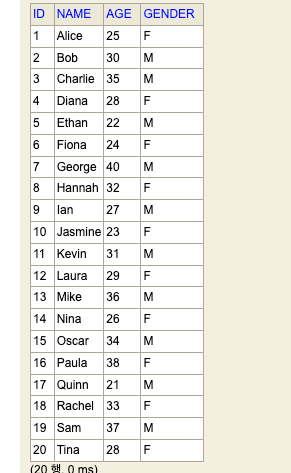
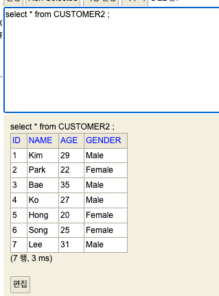

# JdbcPagingItemReader 로 DB 내용을 읽고 , JdbcBatchItemWriter 로 DB에 쓰기

## JdbcPagingItemReader  개요

- JdbcPagingItemReader 는 Spring Batch 에서 제공하는 ItemReader 로, 데이터베이스로부터 데이터를 페이지 단위로 읽는다. 
- 대규모 데이터 처리 효율성 : 메모리 사용량을 최소화하고 커밋 간격을 설정하여 대규모 데이터를 효율적으로 처리할 수 있다.
- 쿼리 최적화 : SQL 쿼리를 직접 작성하여 최적화된 데이터 읽기가 가능하다.
- 커서 제어 : 데이터베이스 커서를 사용하여 데이터 순회를 제어할 수 있다.

## JdbcPagingItemReader 주요 구성 요소

- DataSource : 데이터베이스 연결 정보를 설정한다.
- SqlQuery : 데이터를 읽을 SQL 쿼리를 설정한다. 
- RowMapper : SQL 쿼리 결과를 Item 으로 변환하는 역할을 한다.
- PageSize : 페이지 크기를 설정한다. 
- SkippableItemReader : 오류 발생시 해당 Item 을 건너 뛸 수 있도록 한다.
- ReadListener : 읽기 시작, 종료, 오류 발생 등의 이벤트를 처리할 수 있도록 한다.
- SaveStateCallback : 잡 중단시 현재 상태를 저장하여 재시작 시 이어서 처리할 수 있도록 한다.

## JdbcPagingItemReader 샘플 코드

### Customer 클래스 생성

```java
@Getter
@Setter
public class Customer {

    private String name;
    private int age;
    private String gender;
}
```
### 쿼리 Provider 생성하기

- 쿼리 Provider 는 실제 배치를 위해서 데이터를 읽어올 쿼리를 작성한다.

```java
    @Bean
    public PagingQueryProvider queryProvider() throws Exception {
        SqlPagingQueryProviderFactoryBean queryProvider = new SqlPagingQueryProviderFactoryBean();
        queryProvider.setDataSource(dataSource);
        queryProvider.setSelectClause("id ,name,age,gender");
        queryProvider.setFromClause("from customer");
        queryProvider.setWhereClause("where age >= :age");

        Map<String , Order> sortKeys = new HashMap<>(1);
        sortKeys.put("id", Order.DESCENDING);
        
        queryProvider.setSortKeys(sortKeys);
        
        return queryProvider.getObject();
    }
```

- SqlPagingQueryProviderFactoryBean : 쿼리 프로바이더 팩토리
- setDataSource : 데이터소스를 설정한다.
- setSelectClause : select 에서 프로젝션할 필드 이름을 지정한다. 
- setFromClause : 조회할 테이블
- setWhereClause : 조건절
- setSortKeys : 소트 키를 지정한다.

### JdbcPagingItemReader 작성하기

```java
    @Bean
    public JdbcPagingItemReader<Customer> jdbcPagingItemReader() throws Exception {
        
        Map<String , Objects> parameterValue = new HashMap<>();
        parameterValue.put("age" ,30);
        
        return new JdbcPagingItemReaderBuilder<>()
                .name("jdbcPagingItemReader")
                .fetchSize(CHUNK_SIZE)
                .dataSource(dataSource)
                .rowMapper(new BeanPropertyRowMapper<>(Customer.class))
                .queryProvider(queryProvider())
                .parameterValues(parameterValue)
                .build();
    }
```

### 전체 코드

```java
@Slf4j
@Configuration
public class JdbcPagingReaderJobConfig {

    public static final int CHUNK_SIZE = 2;
    public static final String ENCODING = "UTF-8";
    public static final String JDBC_PAGING_CHUNK_JOB = "JDBC_PAGING_CHUNK_JOB";

    @Autowired
    DataSource dataSource;


    @Bean
    public PagingQueryProvider queryProvider() throws Exception {
        SqlPagingQueryProviderFactoryBean queryProvider = new SqlPagingQueryProviderFactoryBean();
        queryProvider.setDataSource(dataSource);
        queryProvider.setSelectClause("id ,name ,age ,gender");
        queryProvider.setFromClause("from customer");
        queryProvider.setWhereClause("where age >= :age");

        Map<String, Order> sortKeys = new HashMap<>(1);
        sortKeys.put("id", Order.DESCENDING);

        queryProvider.setSortKeys(sortKeys);

        return queryProvider.getObject();

    }

    @Bean
    public JdbcPagingItemReader<Customer> jdbcPagingItemReader() throws Exception {

        Map<String, Object> parameterValue = new HashMap<>();
        parameterValue.put("age", 30);

        return new JdbcPagingItemReaderBuilder<Customer>()
                .name("jdbcPagingItemReader")
                .fetchSize(CHUNK_SIZE)
                .dataSource(dataSource)
                .rowMapper(new BeanPropertyRowMapper<>(Customer.class))
                .queryProvider(queryProvider())
                .parameterValues(parameterValue)
                .build();
    }

    @Bean
    public FlatFileItemWriter<Customer> customerFlatFileItemWriter() {
        return new FlatFileItemWriterBuilder<Customer>()
                .name("customerFlatFileItemWriter")
                .resource(new FileSystemResource("./output/customer_new_v1.csv"))
                .encoding(ENCODING)
                .delimited().delimiter("\t")
                .names("Name", "Age", "Gender")
                .build();
    }


    @Bean
    public Step customerJdbcPagingStep(JobRepository jobRepository, PlatformTransactionManager transactionManager) throws Exception {
        log.info("------------------ Init customerJdbcPagingStep -----------------");

        return new StepBuilder("customerJdbcPagingStep", jobRepository)
                .<Customer, Customer>chunk(CHUNK_SIZE, transactionManager)
                .reader(jdbcPagingItemReader())
                .writer(customerFlatFileItemWriter())
                .build();
    }

    @Bean
    public Job customerJdbcPagingJob(Step customerJdbcPagingStep, JobRepository jobRepository) {
        log.info("------------------ Init customerJdbcPagingJob -----------------");
        return new JobBuilder(JDBC_PAGING_CHUNK_JOB, jobRepository)
                .incrementer(new RunIdIncrementer())
                .start(customerJdbcPagingStep)
                .build();
    }
}
```

### 결과

h2 DB 에 Customer 테이블을 만들고 데이터를 미리 생성한다.



- output 디렉토리에 customer_new_v1.csv 파일이 생성되고 내용은 다음과 같다.

```csv
Sam	37	M
Rachel	33	F
Paula	38	F
Oscar	34	M
Mike	36	M
Kevin	31	M
Hannah	32	F
George	40	M
Charlie	35	M
Bob	30	M

```

## JdbcBatchItemWriter 개요

- JdbcBatchItemWriter Spring Batch 에서 제공하는 ItemWriter 인터페이스를 구현하는 클래스이다.
- 데이터를 JDBC 를 통해 데이터베이스에 저장하는 데 사용된다.

## JdbcBatchItemWriter 구성 요소

- DataSource : 데이터베이스 연결 정보를 지정한다.
- SqlStatementCreator : INSERT 쿼리를 생성하는 역할을 한다.
- PreparedStatementSetter : INSERT 쿼리의 파라미터 값을 설정하는 역할을 한다.
- ItemSqlParameterSourceProvider : Item 객체를 기반으로 PreparedStatementSetter 에 전달할 파라미터 값을 생성하는 역할을 한다.


### 장점

- 데이터베이스 연동 : JDBC 를 통해 다양한 데이터베이스에 데이터를 저장할 수 있다.
- 성능 : 대량의 데이터를 빠르게 저장할 수 있다.
- 유연성 : 다양한 설정을 통해 원하는 방식으로 데이터를 저장할 수 있다.

### 단점
- 설정 복잡성 : JDBC 설정 및 쿼리 작성이 복잡할 수 있다. 
- 데이터베이스 종속 : 특정 데이터베이스에 종속적이다.
- 오류 가능성 : 설정 오류 시 데이터 손상 가능성이 있다.


### 테이블 생성하기 

```sql
CREATE TABLE CUSTOMER2 (
    id BIGINT AUTO_INCREMENT PRIMARY KEY,
    name VARCHAR(255) NOT NULL,
    age INT,
    gender VARCHAR(255) 
);
```

### JdbcBatchItemWriter 작성하기

```java
    @Bean
    public JdbcBatchItemWriter<Customer> flatFileItemWriter() {
        return new JdbcBatchItemWriterBuilder<>()
                .dataSource(dataSource)
                .sql("INSERT INTO customer2 (name ,age , gender) VALUES (?, ?, ? )")
                .itemSqlParameterSourceProvider(new CustomerItemSqlParameterSourceProvider())
                .build();
    }
```

### SqlParameterSourceProvider 작성하기

```java
public class CustomerItemSqlParameterSourceProvider implements ItemSqlParameterSourceProvider<Customer> {
    @Override
    public SqlParameterSource createSqlParameterSource(Customer item) {
        return new BeanPropertySqlParameterSource(item);
    }
}

```

### 전체 소스

```java
@Slf4j
@Configuration
public class JdbcBatchItemConfig {

    public static final int CHUNK_SIZE = 100;
    public static final String ENCODING = "UTF-8";
    public static final String JDBC_BATCH_WRITER_CHUNK_JOB = "JDBC_BATCH_WRITER_CHUNK_JOB";

    @Autowired
    DataSource dataSource;

    @Bean
    public FlatFileItemReader<Customer> flatFileItemReader() {

        return new FlatFileItemReaderBuilder<Customer>()
                .name("FlatFileItemReader")
                .resource(new ClassPathResource("./customers.csv"))
                .encoding(ENCODING)
                .linesToSkip(1)
                .delimited().delimiter(",")
                .names("name", "age", "gender")
                .targetType(Customer.class)
                .build();
    }

    @Bean
    public JdbcBatchItemWriter<Customer> flatFileItemWriter() {
        return new JdbcBatchItemWriterBuilder<Customer>()
                .dataSource(dataSource)
                .sql("INSERT INTO customer2 (name, age, gender) VALUES (:name, :age, :gender)")
                .itemSqlParameterSourceProvider(new CustomerItemSqlParameterSourceProvider())
                .build();
    }

    @Bean
    public Step flatFileStep(JobRepository jobRepository, PlatformTransactionManager transactionManager) {
        log.info("------------------ Init flatFileStep -----------------");

        return new StepBuilder("flatFileStep", jobRepository)
                .<Customer, Customer>chunk(CHUNK_SIZE, transactionManager)
                .reader(flatFileItemReader())
                .writer(flatFileItemWriter())
                .build();
    }

    @Bean
    public Job flatFileJob(Step flatFileStep, JobRepository jobRepository) {
        log.info("------------------ Init flatFileJob -----------------");
        return new JobBuilder(JDBC_BATCH_WRITER_CHUNK_JOB, jobRepository)
                .incrementer(new RunIdIncrementer())
                .start(flatFileStep)
                .build();
    }
}
```

## 결과

