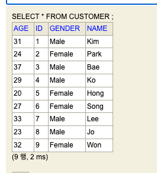
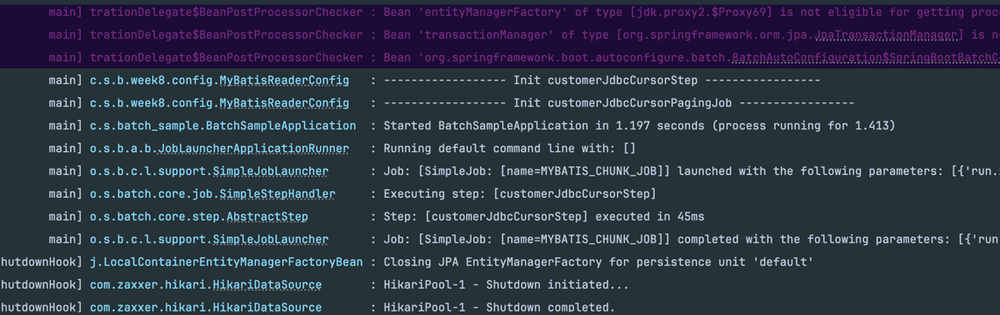

# CompositeItemProcessor 으로 여러 단계에 걸쳐 데이터 Transform 하기

## CompositeItemProcessor 개요

- CompositeItemProcessor 는 Spring Batch 에서 제공하는 ItemProcessor 인터페이스를 구현하는 클래스이다.
- 여러 개의 ItemProcessor 를 하나의 Processor 로 연결하여 여러 단계의 처리를 수행할 수 있도록 한다.

## 주요 구성 요소

- Delegates : 처리를 수행할 ItemProcessor 목록이다.
- TransactionAttribute : 트랜잭션 속성을 설정한다.

### 장점

- 단계별 처리 : 여러 단계로 나누어 처리를 수행하여 코드를 명확하고 이해하기 쉽게 만들 수 있다.
- 재사용 가능성 : 각 단계별 Processor 를 재사용하여 다른 Job 에서도 활용할 수 있다.
- 유연성 : 다양한 ItemProcessor 를 조합하여 원하는 처리 과정을 구현할 수 있다.

### 단점

- 설정 복잡성 : 여러 개의 Processor 를 설정하고 관리해야 하기 때문에 설정이 복잡해질 수 있다.
- 성능 저하 : 여러 단계의 처리 과정을 거치므로 성능이 저하될 수 있다.

## 샘플 코드

### LowerCaseItemProcessor 작성하기

```java
public class LowerCaseItemProcessor implements ItemProcessor<Customer, Customer> {
    @Override
    public Customer process(Customer item) throws Exception {
        item.setName(item.getName().toLowerCase());
        item.setGender(item.getGender().toLowerCase());
        return item;
    }
}
```

- ItemProcessor 를 구현하고, process 메소드를 구현한다.
- 이름과 성별을 소문자로 변경한다.

### After20YearItemProcessor 작성하기

- 나이에 20년을 더하기 위한 ItemProcessor 를 작성한다.

```java
public class After20YearsItemProcessor implements ItemProcessor<Customer, Customer> {
    @Override
    public Customer process(Customer item) throws Exception {
        item.setAge(item.getAge() + 20);
        return item;
    }
}
```

- ItemProcessor 를 구현하고, process 메소드를 구현하였다.
- 단순히 나이에 20을 더했다.

### CompositeItemProcess 구현하기

```java
  @Bean
    public CompositeItemProcessor<Customer, Customer> compositeItemProcessor() {
        return new CompositeItemProcessorBuilder<Customer, Customer>()
                .delegates(List.of(
                        new LowerCaseItemProcessor(),
                        new After20YearsItemProcessor()
                ))
                .build();
    }
```

- CompositeItemProcessorBuilder delegates 를 통해서 ItemProcessor 가 수행할 순서대로 배열을 만들어 전달했다.


## 전체 샘플 코드

```java
@Slf4j
@Configuration
public class MyBatisReaderConfig {
    public static final int CHUNK_SIZE = 2;
    public static final String ENCODING = "UTF-8";
    public static final String MYBATIS_CHUNK_JOB = "MYBATIS_CHUNK_JOB";

    @Autowired
    DataSource dataSource;

    @Autowired
    SqlSessionFactory sqlSessionFactory;


    @Bean
    public MyBatisPagingItemReader<Customer> myBatisItemReader() {
        return new MyBatisPagingItemReaderBuilder<Customer>()
                .sqlSessionFactory(sqlSessionFactory)
                .pageSize(CHUNK_SIZE)
                .queryId("com.study.batch_sample.week8.mapper.CustomerMapper.selectCustomers")
                .build();
    }

    @Bean
    public FlatFileItemWriter<Customer> customerCursorFlatFileItemWriter() {
        return new FlatFileItemWriterBuilder<Customer>()
                .name("customerCursorFlatFileItemWriter")
                .resource(new FileSystemResource("./output/customer_new_v5.csv"))
                .encoding(ENCODING)
                .delimited().delimiter("\t")
                .names("Name","Age","Gender")
                .build();
    }

    @Bean
    public CompositeItemProcessor<Customer, Customer> compositeItemProcessor() {
        return new CompositeItemProcessorBuilder<Customer, Customer>()
                .delegates(List.of(
                        new LowerCaseItemProcessor(),
                        new After20YearsItemProcessor()
                ))
                .build();
    }

    @Bean
    public Step customerJdbcCursorStep(JobRepository jobRepository, PlatformTransactionManager transactionManager) throws Exception {
        log.info("------------------ Init customerJdbcCursorStep -----------------");

        return new StepBuilder("customerJdbcCursorStep", jobRepository)
                .<Customer, Customer>chunk(CHUNK_SIZE, transactionManager)
                .reader(myBatisItemReader())
                .processor(compositeItemProcessor())
                .writer(customerCursorFlatFileItemWriter())
                .build();
    }

    @Bean
    public Job customerJdbcCursorPagingJob(Step customerJdbcCursorStep, JobRepository jobRepository) {
        log.info("------------------ Init customerJdbcCursorPagingJob -----------------");
        return new JobBuilder(MYBATIS_CHUNK_JOB, jobRepository)
                .incrementer(new RunIdIncrementer())
                .start(customerJdbcCursorStep)
                .build();
    }

}

```

## 실습

Customer 테이블에 있는 데이터



### 실행




### 결과 

output/customer_new_v5.csv  

```csv
kim	51	male
park	44	female
bae	57	male
ko	49	male
hong	40	female
song	47	female
lee	53	male
jo	43	male
won	52	female
```